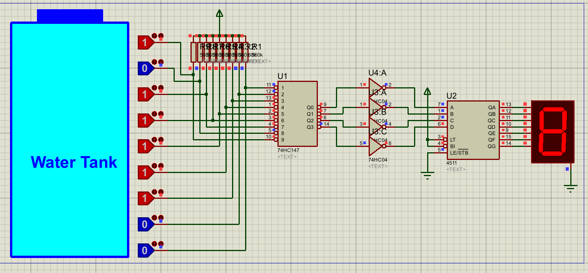
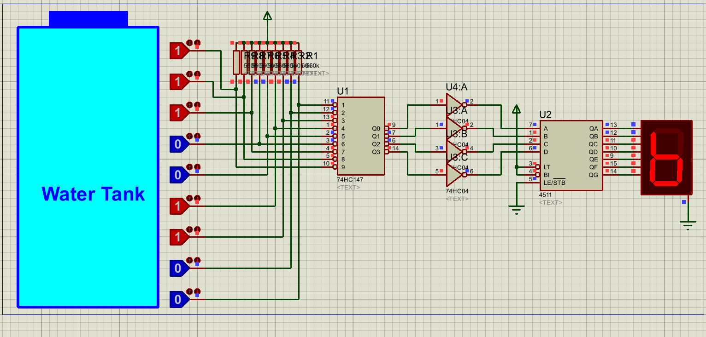

# Digital Water Level Display

## Overview

This project demonstrates a digital water level display system using encoders, BCD to 7-segment decoders, and hex inverters implemented in Proteus.

## Components Used

- **Encoders**: Convert water level inputs to binary code
- **BCD to 7-Segment Decoder**: Converts binary coded decimal to 7-segment display format
- **Hex Inverter**: Logic inversion for signal processing
- **7-Segment Display**: Shows water level readings

## Circuit Description

The system monitors water levels and displays the current level on a 7-segment display. Water level sensors provide input to encoders which generate BCD output. The BCD signal is then decoded to drive the 7-segment display showing the water level.

## Files

- `Digital Water Level Display using Encoders, BCD to 7 Segment and Hex Inverter.pdsprj` - Main Proteus simulation file

## Screenshots

_Circuit schematic showing the complete water level display system_

_Simulation output displaying water level on 7-segment display_

## Demo Video

<video width="600" controls>
  <source src="Screenshots/video.mp4" type="video/mp4">
  Your browser does not support the video tag.
</video>

_Note: If video doesn't display, [download it here](Screenshots/video.mp4)_

## How to Run

1. Open the `.pdsprj` file in Proteus ISIS
2. Run the simulation
3. Toggle input switches to simulate different water levels
4. Observe the 7-segment display showing corresponding water level readings

## Learning Objectives

- Understanding encoder operation
- BCD to 7-segment decoding
- Hex inverter applications
- Digital display systems
